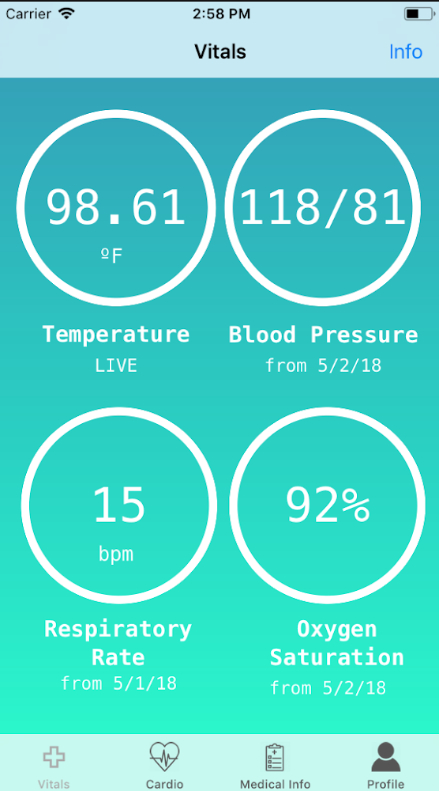
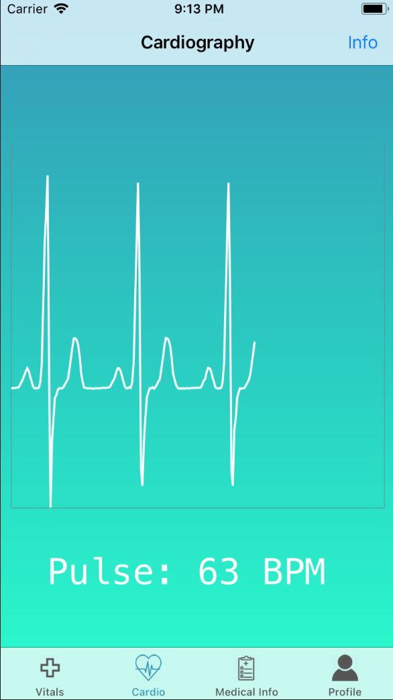

# WACT-Mobile

The WACT Mobile Medical app is a mobile device that allows patients to monitor their own vital signs and record information for clinicians to view in real-time at any location. The app features both a patient and clinician interface. Patients can record their ECG and other vitals, and view important medical information such as prescriptions and doctor contact information. Clinicians can view live patient vital signs, and also look at historical recorded data. Clinicians can also view and update patient medical information.The device also had a hardware component. We used a Raspberry Pi to read live data from a function generator, filter it, and send it to the mobile app over WiFi. 

Vitals and ECG:
 

Built with Tanya Sinha, Annie Geheran, and Winnie Zheng
